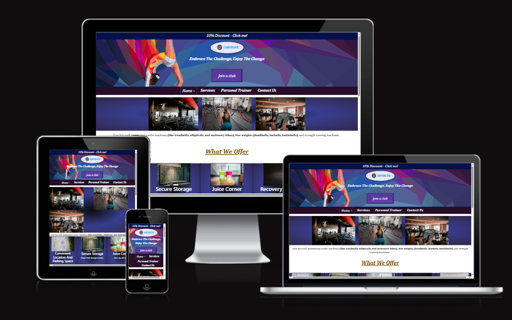

#                                 Champion Gym And Club Website  

*Welcome to the [Champions Gym And Club](https://8000-farah94-projectonemiles-lmrovgr2hc8.ws.codeinstitute-ide.net/mainpage.html) official website. It is responsible for managing its size for different devices for great visualization for customers and working partners.* 

 
 ## User Experience (UX)
### User Stories
  * First-time Visitor Goal
    - As a first-time visitor,  I want to see relevant information about my needs on the main page and I want to go further to understand their entire services. 
    -  As a first-time visitor, I want the website to be user-friendly. 
    -. As a first-time visitor, I want to easily understand the quality of services they can provide to their customers and what customers should expect from them.
    - As a first-time visitor, I want to know any special service for beginners in swimming and dance.
    -. As a first-time visitor, I want to navigate their social media sites to see how much people trust them through their number of followers.

 * Returning Visitor Goals
    - As a returning visitor, I want to find any offers/discounts they give when joining them.
    - As a returning visitor, I want to find out the contact details for any unpleasant situation.
    - As a returning visitor, I want to know the date and time of my lesson on my email/text which I booked.

 * Frequent Visitor Goals
    - As a frequent visitor, I want to get updates about new offers/discounts for my particular service on my email address.
    - As a frequent visitor, I want to get email update about new post on social media site.  

## Design
*  Colour Scheme
- The website's main page body colour is white and its sections have three background colours: black, dark blue and dark purple. 

* Typography
 - 

 * Imagery
 -  