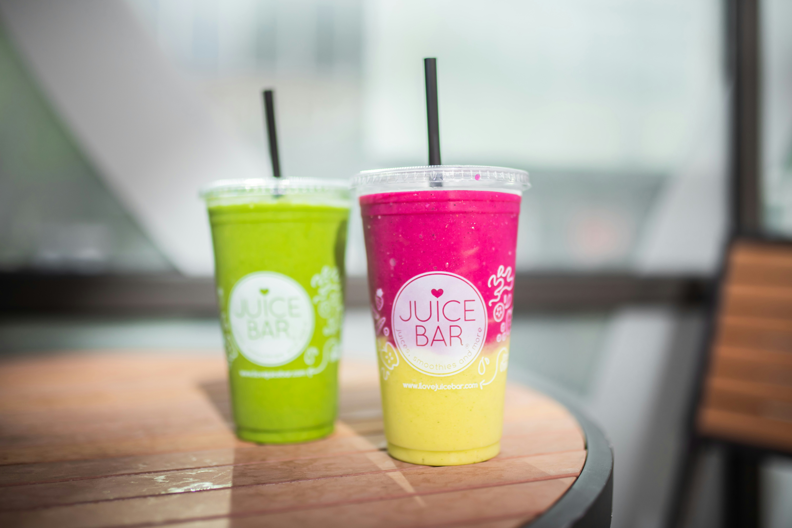
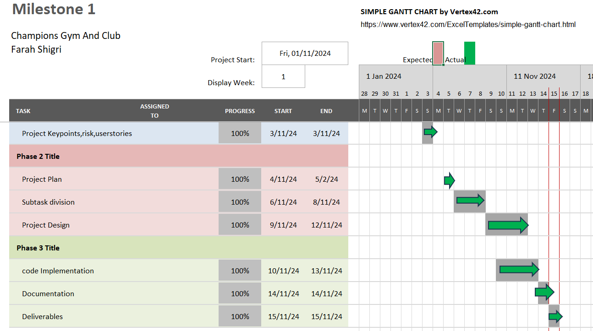

#                                 Champion Gym And Club Website  

*Welcome to the [Champions Gym And Club](https://farah-94.github.io/projectonemilestone/index.html) official website. It is responsible for managing its size for different devices for great visualization for customers and working partners.* 

## Links

- **GitHub Repository**: [Project Repository](https://github.com/Farah-94/projectonemilestone)
- **Website**: [Champions Gym And Club](https://farah-94.github.io/projectonemilestone/index.html)

# Purpose 
  The project serves many important purposes. 
  - The main purpose of this website is to encourage people towards healthy life by showcasing 
    advance gym equipments and what the Champions gym and club offers.      
  - It has facilities like finger print locker room, luxury recovery rooms, refreshment 
    corner, free wifi, clean and secure enviroment and convinient location. 
  - The website provides you all the information about gym, dance and swimming.
  - You can signup free and book your suitable trainer with the appointment button.   
 
 ## User Experience (UX)
### User Stories
  * First-time Visitor Goal
    - As a first-time visitor,  I want to see relevant information about my needs on the main page and I want to go further to understand their entire services. 
     -  As a first-time visitor, I want the website to be user-friendly. 
     - As a first-time visitor, I want to easily understand the quality of services they can provide to their customers and what customers should expect from them.
     - As a first-time visitor, I want to know any special service for beginners in swimming and dance.
     - As a first-time visitor, I want to navigate their social media sites to see how much people trust them through their number of followers.

 * Returning Visitor Goals
     - As a returning visitor, I want to find any offers/discounts they give when joining them.
     - As a returning visitor, I want to find out the contact details for any unpleasant situation.
     - As a returning visitor, I want to know the date and time of my lesson on my email/text which I booked.

 * Frequent Visitor Goals
     - As a frequent visitor, I want to get updates about new offers/discounts for my particular service on my email address.
     - As a frequent visitor, I want to get email update about new post on social media site.  

## Design
*  Colour Scheme
    - The website's main page has a white body colour.
    - The website services page has a blue body 
     colour.
    - The website trainer page has a blue body 
   colour. 
    - sections and divs have three background colours: black, dark blue and dark purple. 

*  Typography
   - The Cambria Cochin is the main font used throughout the whole website, with Serif as the fallback font in case, for any reason, the font isn't being imported correctly.

*  Imagery
    * Website
      
      
      
      
      
      
      
      
    * Logo
      - The logo is a simple and clear image. It is designed to highlight the name of the gym. 
    * Background Image
       -  The multi-color background image in the header is set to attract the user.   
    * Website Content   
       - There are three images in the content section.These images are designed to show the gym machines, types of equipment, gym atmosphere, values and mission for light to heavy workouts.   
         
         
       
    * Facilities    
      - There are five more images on the main page of the website. These images describe the facilities that the gym offers to its members. 
         1. the gym location is near to the train station.
         2. there are well maintained recovery rooms. 
         3. there is a fingerprint locker room for the safety. 
         4. there is a refreshment corner.
         5. last, you will experience healthy and sterile enviroment.
   
   
   
   
   
   
* Wireframes
    - Home Page Wireframe - [view here](https://www.figma.com/design/5IJvJkYiBcvDniuKs1oU3s/Champions-Gym-And-Club?node-id=0-1)  
    - Services Page Wireframe - [view here](https://www.figma.com/design/5IJvJkYiBcvDniuKs1oU3s/Champions-Gym-And-Club?node-id=1-2)
    - Trainer Page Wireframe - [view here](https://www.figma.com/design/5IJvJkYiBcvDniuKs1oU3s/Champions-Gym-And-Club?node-id=1-3)

## Features
  + Responsive on all device sizes
  + Interactive elements

## Technologies Used
  ### Languages Used
   * [HTML5](https://en.wikipedia.org/wiki/HTML5)
   * [CSS3](https://en.wikipedia.org/wiki/CSS)
 
  ### Frameworks, Libraries & Programs Used
   1. [Bootstrap v5.3 :](https://getbootstrap.com/)
        - Bootstrap is used for responsiveness and styling of web pages.
   2. [Google Fonts :](https://fonts.google.com/) 
        - Google fonts are used to import cabin fonts into the styleproject1.css.
   3. [Git :](https://git-scm.com/)
        - With the help of Git. Gitpod pushes and commits the changes inside the code.
   4. [GitHub :](https://github.com/)
        - GitHub is used to store and edit the project.
   5. [Figma :](https://www.figma.com/)
        - Figma is used to design the website.  
   6. [Unsplash :](https://unsplash.com/)
        - Images used throughout the project except real.png is from Unsplash.  

   7. Gantt Chart
      

## Testing
### Test Report: 
* [Testplan:](https://1drv.ms/w/c/e1af83f369e97fb7/Eez8WCMwBzpEpUyOpNUu8hcBBDhdS7xDVWb86MZuTwCMzA?e=MzT6Pf)
* Expected :
     - This project aims to gain customer attention through the 
      services offered and convince them to join a club. The project should have three sections or pages. The code 
      should be in HTML5 and CSS3. The main page should be connected with the other pages and sections. Images should be used on different pages/sections to display types of equipment, internal environments, and service options. This project should be responsive on different devices. The project should have the W3C testing validation.   

* Actual :
   - The design and functionality of this project have 
      successfully achieved the requirements. This is responsive on different screen sizes. The developer writes the code in HTML and CSS within the timeframe. Images are used on three pages. There are total six pages and some pages have internal link sections to provide details. The developer successfully created the design of the website with the help of Figma. Bootstrap is used to improve the structutre of the website. CSS is tested from W3C testing validation.  
       
       
             
      
      
      
      
      

* Error List: 
   - The application is working fine. There is no error found. 
          Types of tests that are carried out during the testing process:
   - White Box testing is carried out successfully. It means the 
          structure of the actual code is tested. The developer uses the same classes multiple times which enhances the code's Usability. It fulfills the required criteria.

      
                         
